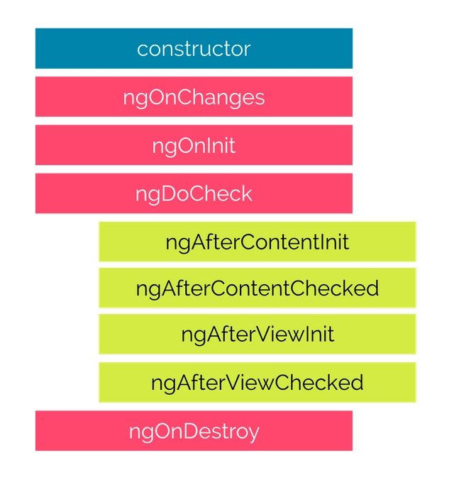

A component in Angular has a life-cycle, a number of different phases it goes through from birth to death.

We can hook into those different phases to get some pretty fine grained control of our application.

To do this we add some specific methods to our component class which get called during each of these life-cycle phases,
we call those methods hooks.

The hooks are executed in this order:

These phases are broadly split up into phases that are linked to the component itself and phases that are linked to the
children of that component.

## Hooks for the Component

### constructor

This is invoked when Angular creates a component or directive by calling new on the class.

### ngOnChanges

Invoked every time there is a change in one of th input properties of the component.

### ngOnInit

Invoked when given component has been initialized.
This hook is only called once after the first ngOnChanges

### ngDoCheck

Invoked when the change detector of the given component is invoked. It allows us to implement our own change detection
algorithm for the given component.

### ngOnDestroy

This method will be invoked just before Angular destroys the component.
Use this hook to unsubscribe observables and detach event handlers to avoid memory leaks.

## Hooks for the Component’s Children

These hooks are only called for components and not directives.

### ngAfterContentInit

Invoked after Angular performs any content projection into the component’s view (see the previous lecture on Content
Projection for more info).

### ngAfterContentChecked

Invoked each time the content of the given component has been checked by the change detection mechanism of Angular.

### ngAfterViewInit

Invoked when the component’s view has been fully initialized.

### ngAfterViewChecked

Invoked each time the view of the given component has been checked by the change detection mechanism of Angular.

## Adding Hooks

In order to demonstrate how the hooks work we’ll adjust the joke application we’ve been working with so far.

Firstly let’s change the JokeComponent so it hooks into all the phases.

All we need to do is to add functions to the component class matching the hook names above, like so:

class JokeComponent {

@Input('joke') data: Joke;

constructor() {

console.log(`new - data is ${this.data}`);

}

ngOnChanges() {

console.log(`ngOnChanges - data is ${this.data}`);

}

ngOnInit() {

console.log(`ngOnInit - data is ${this.data}`);

}

ngDoCheck() {

console.log("ngDoCheck")

}

ngAfterContentInit() {

console.log("ngAfterContentInit");

}

ngAfterContentChecked() {

console.log("ngAfterContentChecked");

}

ngAfterViewInit() {

console.log("ngAfterViewInit");

}

ngAfterViewChecked() {

console.log("ngAfterViewChecked");

}

ngOnDestroy() {

console.log("ngOnDestroy");

}
}

To easily trigger these hooks let’s change the rest of the application. We remove the form and change the parent
JokeListComponent so it has two buttons. One that adds a joke triggering Angular to create a new JokeComponent instance.
Another button to clear the list of jokes triggering Angular to delete the JokeComponents.

@Component({

selector: 'joke-list',

template: `

<joke *ngFor="let j of jokes" [joke]="j">

`{{ j.setup }} ?`

`<h1 class="punchline">{{ j.punchline }}</h1>`

`</joke>`

<button type="button"

class="btn btn-success"

(click)="addJoke()">Add Joke

</button>

<button type="button"

class="btn btn-danger"

(click)="deleteJoke()">Clear Jokes

`</button>`

`

})

class JokeListComponent {

jokes: Joke[] = [];

addJoke() {

this.jokes.unshift(new Joke("What did the cheese say when it looked in the mirror", "Hello-me (Halloumi)"));

}

deleteJoke() {

this.jokes = []

}
}
